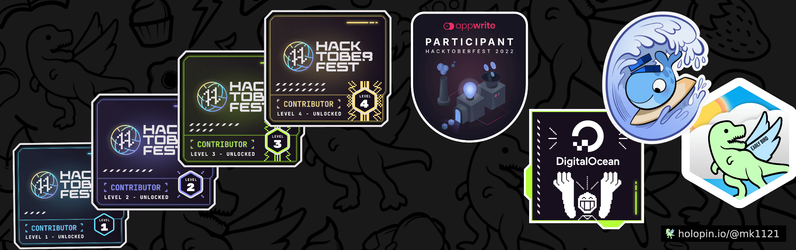

  <h1>
  Hey there
  ()
    I am Md. Abdullah Al Maruf
</h1>
 <h4>Front End Developer</h4>

---

### :man_technologist: About Me :

- :telescope: I’m currently open for employment opportunites
- Exploring Front-End technologies
- learning new skills and sharpening old ones

---

<h2 align="left">📫 Reach me out:</h2>

<h2 align="left">🏆 Hacktoberfest - 2022 | Open source contribution</h2>

  

<h2 align="left">🏆 GitHub Trophies:</h2>

  

<h2 align="left">💻 Technologies and Tools that I know:</h2>

  
  
 
    
  
 
         

<h2 align='left'>📈 Current Stats</h2>

&nbsp;

<h2 align='left'>🎁 Contributions</h2>

