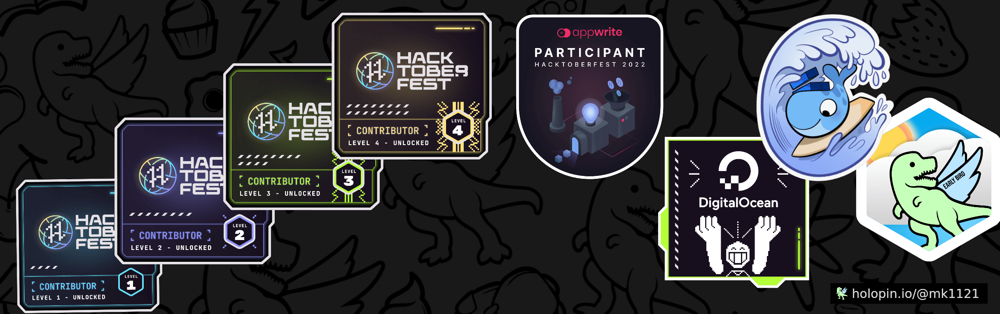

<!-- Animated Typing Header -->

 

<!-- Social & Profile Badges -->

  
  &nbsp;
  
  &nbsp;
  
  &nbsp;
  

---

## 👨‍💻 About Me

- 🔭 &nbsp; Full Stack Developer passionate about building impactful web applications
- 🛡️ &nbsp; Exploring **Penetration Testing** & Cybersecurity
- 🌱 &nbsp; Currently levelling up with **Next.js**, **TypeScript** & **Docker**
- 💼 &nbsp; Open to exciting **employment opportunities**
- ⚡ &nbsp; Fun fact: I debug with `console.log` and I'm not ashamed!

---

## 🚀 Latest Projects

| Project | Description | Tech |
|---------|-------------|------|
| [**Remainder**](https://github.com/mk1121/Remainder) | A productivity reminder application | React, Node.js, MongoDB |
| [**apex-react-integration**](https://github.com/mk1121/apex-react-integration) | Integrating Oracle APEX with React frontend | React, Oracle APEX, REST API |
| [**mk1121**](https://github.com/mk1121/mk1121) | GitHub Profile README | Markdown, GitHub Actions |

---

## 🛠️ Tech Stack

**Frontend**

**Backend & Database**

**DevOps & Tools**

---

## 📊 GitHub Stats

  
  &nbsp;&nbsp;
  

  

---

## 🏆 GitHub Profile Summary

  

  
  &nbsp;
  
  &nbsp;
  
  &nbsp;
  

---

## 📈 Contribution Graph

  

---

## 🎖️ Open Source

  <h3>🏆 Hacktoberfest 2022</h3>
  

---

  <i>✨ "Code is like humor. When you have to explain it, it's bad." – Cory House</i>

